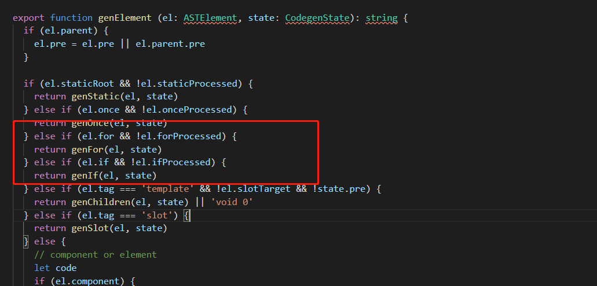

## vue面试训练营 --- kkb
#### 1. v-if和v-for哪个优先级高？ 如果两个同时出现，应该怎么优化得到更好的性能？
+ v-for优先级高于v-if
    + 在vue源码, src\core\instance\state.js中，会有一个if判断，v-for的判断优先于v-if，也就是说只要有v-for，就会直接进入其语句判断中
    
+ 如果同时出现，每次渲染都会先执行循环再判断，无论如何都无法避免循环，浪费性能
+ 如果要避免： 再外层嵌套template， 在这一层进行v-if判断，然后再内部循环遍历
+ 如果条件出现在循环内部，可以通过计算属性过滤掉不需要的项

#### 2.Vue组件data为什么必须是个函数而Vue的根实例则没有此限制？

#### 3.你知道vue中key的作用和工作原理吗？说说你对它的理解。
+ key的主要作用是为了高效的更新虚拟DOM
    + 源码：在patch的过程中会执行pacthVnode,pacthVnode的过程中会执行updateChildren这个方法；会去更新所有新旧子元素。那么在这个过程中，通过key就可以精确的判断两个节点是否是同一个。如果没有key的话就会永远认为是一个相同节点，那么所作的操作就是一定会强制更新，那么就无法避免频繁更新dom元素，性能会很差；如果加上key, 就会利用内部diff算法，避免频繁更新不同元素，使得整个patch过程更加高效，减少DOM操作，提高性能
+ 如果不设置key, 有可能会引起一些隐蔽的bug
+ vue中在使用相同标签名元素的过度切换时，也会用到key，目的也是为了让vue可以区分塔曼，否则vue只会替换其内部属性而不会触发过渡效果

#### 4.你怎么理解vue中的diff算法？
+ diff算法是用来计算虚拟dom中被改变的部分。在vue，react中都有使用
+ vue中的diff算法
    + 必要性： lifecycle.js - mountComponent()
               组件中可能存在多个data中的key的使用，一个组件一个watcher,那么就使用diff就很必要了
    + 执行方式
