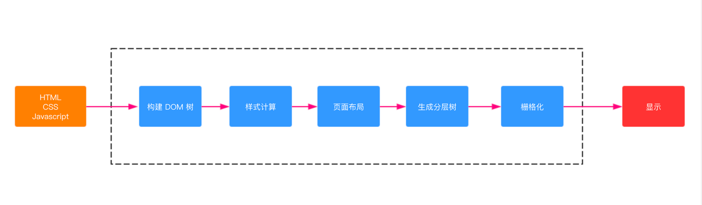
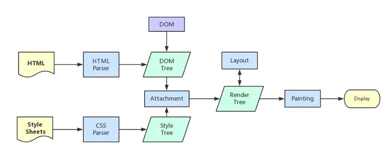

### 一、浏览器相关原理
#### 1.细说浏览器输入URL后发生了什么
+ DNS 解析
    + 首先从缓存中查找
    + 之后从本地hosts中解析ip
    + 再然后从dns服务器上查找
+ 建立TCP连接, 三次握手
+ 发送HTTP请求
    + 服务器收到处理的请求，将数据返回至游览器
    + 游览器收到http响应。
+ 关闭TCP连接
+ 浏览器渲染
    + 按照渲染的时间顺序，流水线可分为如下几个子阶段：构建 DOM 树、样式计算、布局阶段、分层、栅格化和显示。如图：
    
    + 渲染进程将html内容转化为DOM树
    + 解析CSS,产生CSS规则树
    + 解析js脚本，等到js脚本文件加载后， 通过 DOM API 和 CSSOM API 来操作 DOM Tree 和 CSS Rule Tree。
    + 根据DOM树和css树生成Render Tree
    + 根据Render树进行layout(布局),负责各个元素节点的尺寸、位置计算
    + 绘制Render树,绘制页面像素信息
    + 浏览器将各层信息发送给GPU,GPU会将各层合成,显示在屏幕上。
    
        + 由图可以看出,css在加载过程中不会影响DOM树的生成,但是会影响到Render树的生成,从而影响layout。所以link标签需要尽量放到head里边

#### 2.cookies机制和session机制的区别
+ cookies数据保存在客户端。session数据保存在服务端
+ cookies可以减轻服务器压力，但是不安全，容易进行cookies欺骗
+ session安全一点，但是占用服务器资源。
#### 3.常用状态码
+ 1xx: 信息性状态码
+ 2xx: 返回成功
+ 3xx: 重定向状态码---304:缓存中读取
+ 4xx: 客户端错误 --- 404:未找到;403:访问被拒绝
+ 5xx: 服务器错误 --- 500:服务器执行发生错误
#### 4.http和https的区别：
+ HTTPS = HTTP + SSL
+ https有ca证书，http一般没有
+ http是超文本传输协议，信息是明文传输。https则是具有安全性的ssl加密传输协议
+ http默认80端口，https默认443端口。

#### 资料
+ 浏览器页面渲染机制:https://juejin.im/post/6844903815758479374
+ 浏览器输入url: https://juejin.im/post/6844904054074654728#heading-6
